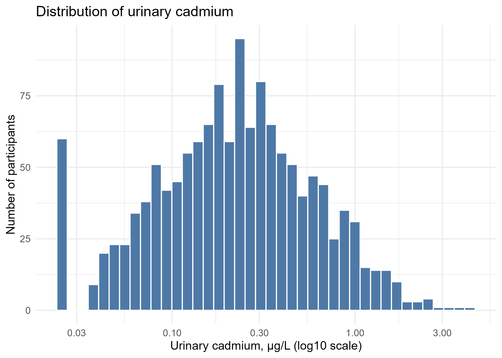
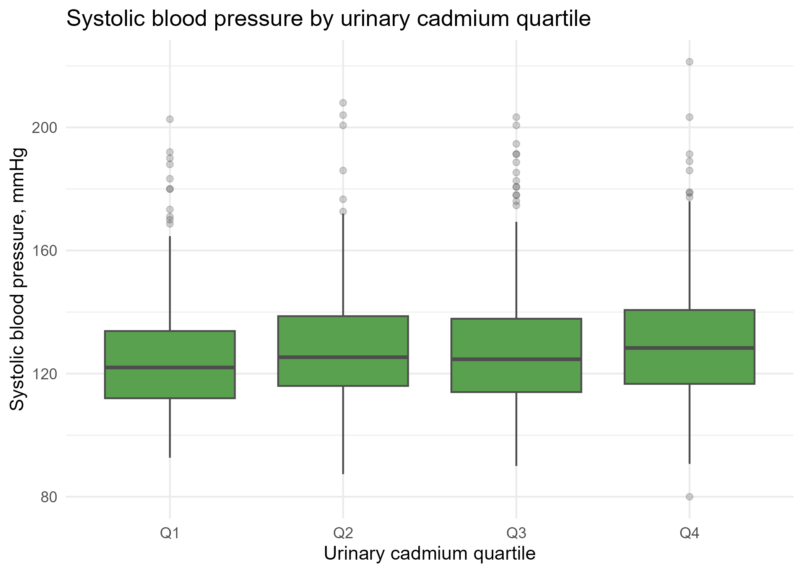
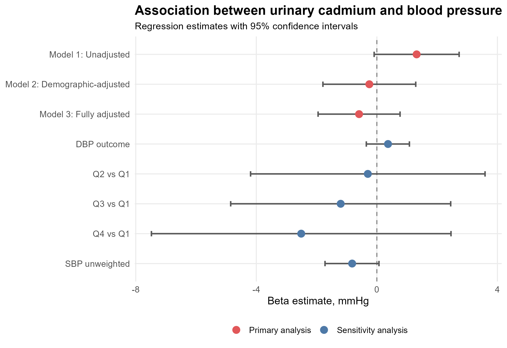

```markdown
# NHANES Cadmium and Blood Pressure Analysis

## Overview

This repository contains a reproducible health data analysis project using the National Health and Nutrition Examination Survey (NHANES) 2017–2018 cycle.

The project examines the association between urinary cadmium exposure and blood pressure outcomes among U.S. adults using survey-weighted statistical methods.

This repository is designed as a portfolio project for PhD/RA applications, health data science roles, epidemiology research training, and data analyst positions.

## Research Question

Is urinary cadmium exposure associated with systolic blood pressure among U.S. adults in NHANES 2017–2018?

## Data Source

The data are from the publicly available NHANES 2017–2018 cycle, administered by the U.S. Centers for Disease Control and Prevention National Center for Health Statistics.

NHANES data files used in this project include demographic, examination, laboratory, and questionnaire components.

Raw NHANES `.XPT` files are not included in this repository and should be downloaded directly from the official NHANES website.

The cleaned participant-level analytic dataset is generated locally by the analysis script and is not included in this repository.

## Study Population

The analytic sample includes adults aged 20 years or older with available data on:

- urinary cadmium
- blood pressure measurements
- survey design variables
- demographic covariates
- smoking-related variables
- body mass index
- urinary creatinine

Participants with missing values in the main analytic variables are excluded from the primary analysis.

## Exposure

The primary exposure is urinary cadmium concentration.

Urinary cadmium is analyzed using:

- log-transformed urinary cadmium
- urinary cadmium quartiles

Urinary creatinine is included as an adjustment variable to account for urine dilution.

## Outcomes

The main outcome is systolic blood pressure.

Additional blood pressure-related outcomes or sensitivity analyses may include:

- diastolic blood pressure
- hypertension status
- alternative covariate adjustment models

## Statistical Analysis

All analyses account for the NHANES complex survey design, including:

- survey weights
- strata
- primary sampling units

The main statistical methods include:

- data cleaning and merging across NHANES components
- descriptive statistics
- survey-weighted baseline characteristics
- survey-weighted linear regression
- covariate-adjusted regression models
- sensitivity analyses
- data visualization

## Repository Structure

```text
nhanes-cadmium-blood-pressure/
├── data_raw/
│   └── README.md
├── data_clean/
│   └── README.md
├── docs/
│   └── writing_sample_nhanes_cadmium_bp.pdf
├── outputs/
│   ├── figures/
│   └── tables/
├── scripts/
│   └── 01_run_full_analysis.R
├── .gitignore
├── LICENSE
└── README.md
```

## How to Reproduce

### 1. Clone this repository

```bash
git clone https://github.com/zonghao-ma/nhanes-cadmium-blood-pressure.git
cd nhanes-cadmium-blood-pressure
```

### 2. Install required R packages

Run the following code in R:

```r
install.packages(c(
  "tidyverse",
  "haven",
  "survey",
  "srvyr",
  "gtsummary",
  "flextable",
  "officer",
  "broom"
))
```

### 3. Download NHANES 2017–2018 files

Download the required NHANES 2017–2018 `.XPT` files from the official NHANES website.

Place the downloaded files in:

```text
data_raw/
```

### 4. Run the full analysis

Run:

```r
source("scripts/01_run_full_analysis.R")
```

### 5. Check generated outputs

The script will generate cleaned data and analysis outputs in:

```text
data_clean/
outputs/tables/
outputs/figures/
```

## Main Outputs

### Tables

The analysis script generates the following tables:

- Table 1: Survey-weighted baseline characteristics
- Table 2: Survey-weighted association between urinary cadmium and systolic blood pressure
- Table 3: Sensitivity analyses

Tables are saved in:

```text
outputs/tables/
```

### Figures

The analysis script generates the following figures:

- Figure 1: Distribution of urinary cadmium
- Figure 2: Systolic blood pressure by urinary cadmium quartile
- Figure 3: Forest plot of primary and sensitivity analyses

Figures are saved in:

```text
outputs/figures/
```

## Example Figures







## Writing Sample

A short writing sample based on this analysis is available in:

```text
docs/writing_sample_nhanes_cadmium_bp.pdf
```

This document summarizes the background, methods, results, and interpretation of the analysis in a research-style format.

## Skills Demonstrated

This project demonstrates skills in:

- R programming
- health data analysis
- NHANES data processing
- complex survey design
- survey-weighted regression
- environmental epidemiology
- blood pressure and cardiovascular risk analysis
- data cleaning and variable construction
- reproducible research workflow
- statistical reporting
- scientific writing
- GitHub-based project organization

## Reproducibility Notes

Raw NHANES data files are not included because they should be downloaded from the official NHANES website.

Cleaned participant-level data are also not included to avoid sharing individual-level analytic datasets.

The analysis script is designed to reproduce the cleaned dataset, tables, and figures after the required raw NHANES files are placed in the `data_raw/` folder.

## Limitations

This project is based on cross-sectional NHANES data, so causal inference is limited.

Urinary cadmium and blood pressure are measured at a single time point.

Residual confounding may remain despite covariate adjustment.

The project is intended for research training, reproducible data analysis demonstration, and portfolio presentation.

## Suggested Citation

If referencing this project, please cite it as:

```text
Ma, Z. NHANES Cadmium and Blood Pressure Analysis. GitHub repository.
https://github.com/zonghao-ma/nhanes-cadmium-blood-pressure
```

## Author

Zonghao Ma

## License

This project is licensed under the terms of the license included in this repository.
```
